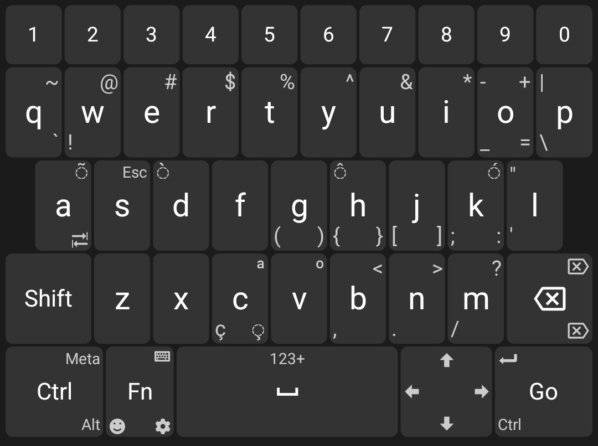

# Unexpected Keyboard
###  - Personal fork for testing and adding personal preferences -  
Readme.md Updated 2022-october

Awesome work on the original [upstream](https://github.com/Julow/Unexpected-Keyboard) repo ❤thank you!

This fork currently has the following extra changes:

- Add 'QWERTY3 + NumberRow layout + Split arrows'
>
- Add 'QWERTY2 + NumberRow layout'
>
- Add QWERTY2 Layout, this layout is an alternative to the original QWERTY, it is a programming layout, (not a localization), the main goal on this layout was first to move the corners extrakeys away from phone's edge (good for bulky phone case), after that some other keys rearrangements were also done to improve the layout overall
- The QWERTY2 layout has adjusted key proportions on the bottom row, giving more importance to the navigation arrows key
- To implement the QWERTY2 Layout, there is some added logic that enable each individual layout to be paired with a specif numeric layout, so it's possible to have different numeric layouts.
- Added an Extra variant APK builder to the makefile, called fork-debug, this extra apk has a different namespace, so it can be installed in parallel to the official APK, very useful for testing, or for building from source a modified version with personal preferences, and still be able to load the official APK at same time.
- Add the capability for the Github CI action to utilize the `DEBUG_KEYSTORE` secret, check the [Contributing](CONTRIBUTING.md) for instructions.
- Add QWERTY2 + Number row layout
- Rearrange many keys after extensive usage study
- Portuguese layout split in qwerty-international style and abnt2 layout style, since both styles are commonly used, and it is a matter of personal preference.
- (screenshots here are hit and miss on how much up to date they are)

### -> Debug APKs on the actions tab (must be logged to github to download) -> [link](https://github.com/sdrapha/Unexpected-Keyboard/actions?query=branch%3Aall-branches-merged-in-one)

### -> Direct link to latest debug apk without having to be logged in to github -> [link](https://nightly.link/sdrapha/Unexpected-Keyboard/workflows/make-apk/all-branches-merged-in-one/sdrapha%20all-branches-merged-in-one%20debug_apk.zip)

-----
## Unexpected Keyboard
A lightweight virtual keyboard for developers.

|  |  |  |
| --- | --- | --- |

This app is a virtual keyboard for Android. The main features are easy typing of every ASCII character using the swipe gesture, dead keys for accents and modifier keys and the presence of special keys (tab, esc, arrows, etc..).

The keyboard shows up to 4 extra characters in the corners of each key. These extra characters are hit by swiping the finger on the key.

Highlight of some of the features:

- Every character and special keys that are also available on a PC keyboard. This is perfect for using applications like Termux.

- This includes Tab, Esc, the arrows and function keys, but also Ctrl and Alt !

- Accented keys are accessible using dead keys. First activate the accent, then type the accented letter.

- Very light and fast. Use 500x times less space than Google's keyboard and 15x times less than the default keyboard. No ad, no tracking.

- Multiple layouts: QWERTY, QWERTZ, AZERTY. Themes: White, Dark, OLED Black. And many other options.

Like any other virtual keyboards, it must be enabled in the system settings. Open the System Settings and go to:
System > Languages & input > On-screen keyboard > Manage on-screen keyboards.

## Contributing

For instructions on building the application, see
[Contributing](CONTRIBUTING.md).

## Screenshots

